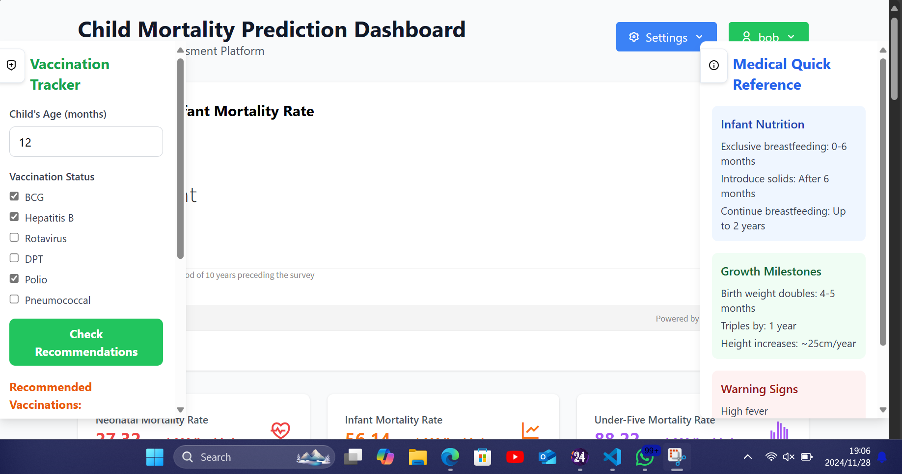
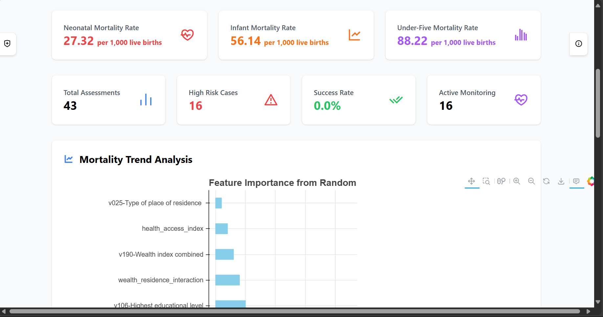
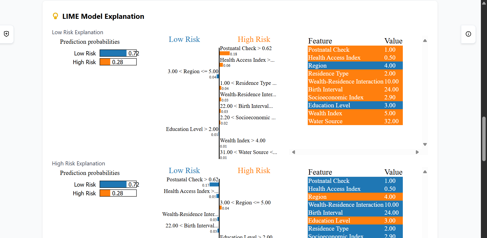
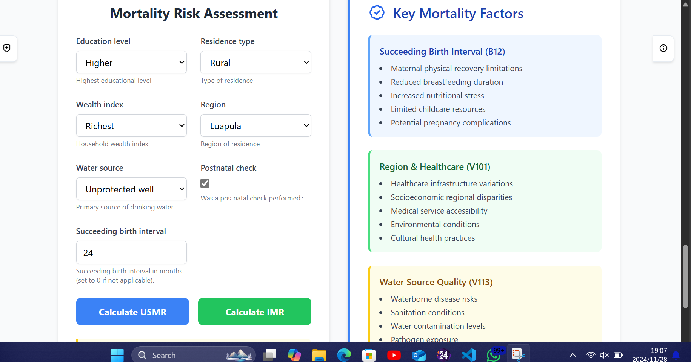
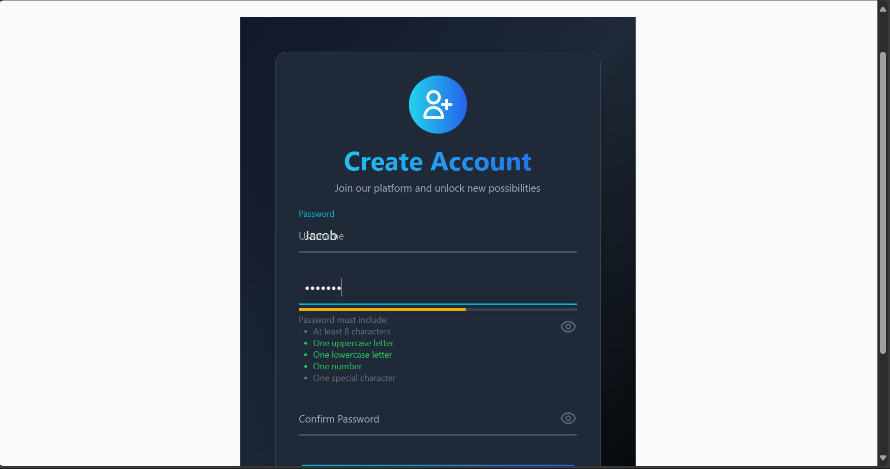
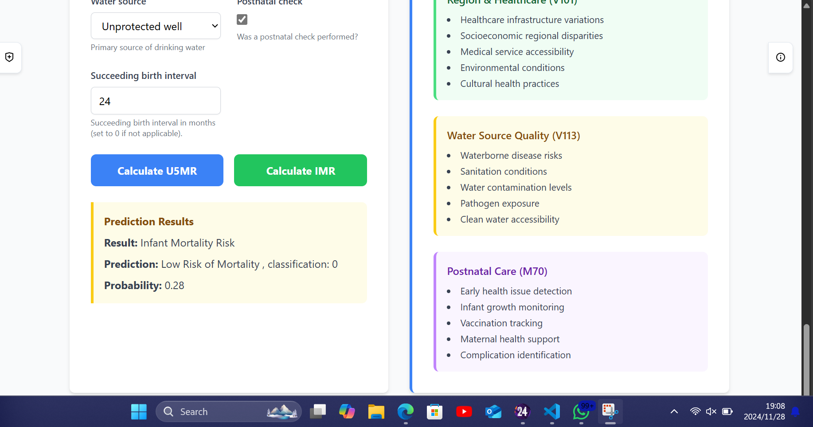
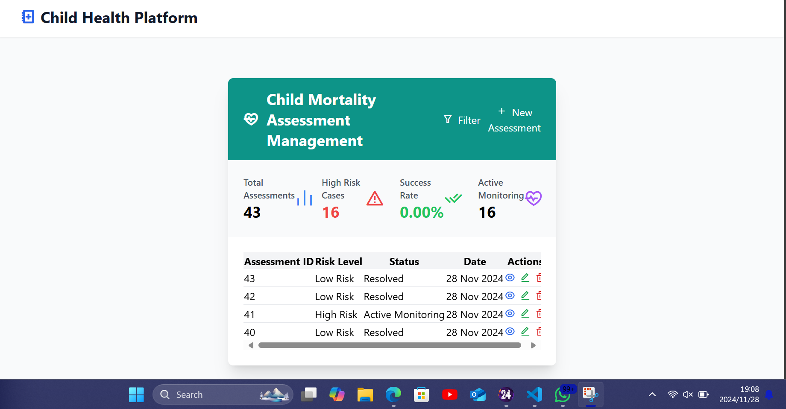
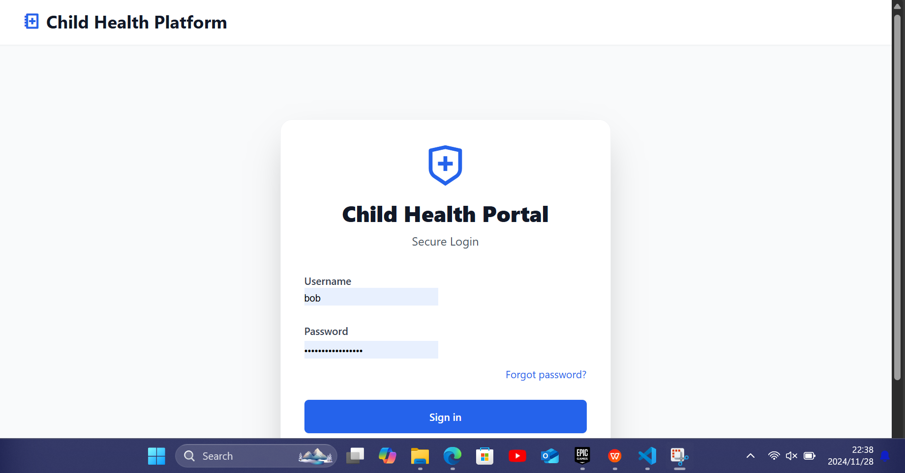

Child Mortality Prediction Dashboard
Welcome to the Child Mortality Prediction Dashboard, a powerful tool for analyzing and predicting child mortality rates, specifically the Infant Mortality Rate (IMR) and the Under-Five Mortality Rate (U5MR). This project leverages machine learning models trained on health and demographic data to provide actionable insights for improving child health outcomes.

📌 Project Overview
This web-based application allows users to:

✅ Predict IMR and U5MR by inputting demographic and health-related data.
✅ View personalized prediction results after logging in or signing up.
✅ Support healthcare providers and policymakers in making data-driven decisions by identifying risk factors and prioritizing interventions.

🚀 Access the Dashboard
The application is hosted online at:
🔗 http://4.222.232.143:8000/dashboard/

📝 How to Use the Dashboard
Step 1: Sign Up or Log In
Navigate to the dashboard.
If you are a new user:
Click on the Sign-Up button to create an account.
Fill in your details and register.
If you already have an account:
Enter your credentials to log in.
📌 Note: You must be logged in to view prediction results.
Step 2: Make Predictions
Scroll to the bottom of the dashboard to find the prediction form.
Fill in the required fields with the relevant data:
For IMR predictions, click the IMR Predict button.
For U5MR predictions, click the U5MR Predict button.
Step 3: View Results
Once logged in, your predictions will be processed.
The results will be displayed on the dashboard.
📸 Screenshots
Here are some previews of the dashboard in action:

🎥 Demo Video
Check out this short demo of the Child Mortality Prediction Dashboard in action:

📺 [Final Year Project Demo](https://github.com/Papatee04/Predictive-Analytics-for-Infant_mortality_and_under_5_child_mortality/blob/main/screenshots/final%20year%20project%20video.mp4)

🔥 Features
✔️ User Authentication: Secure sign-up and login functionality.
✔️ Machine Learning Models: Advanced algorithms provide IMR and U5MR predictions.
✔️ Simple & Intuitive Interface: Easy-to-use forms for input and straightforward access to results.

🚀 Future Enhancements
🔹 Development of a mobile app for real-time access to predictions.
🔹 Integration of additional health metrics like maternal nutrition & immunization coverage.
🔹 Expanding the tool to other regions or countries facing similar child health challenges.

I hope this tool serves as a valuable resource for improving child health outcomes.
📩 Your feedback is highly appreciated and will help refine and expand this project!

Enjoy using the Child Mortality Prediction Dashboard! 🎯
